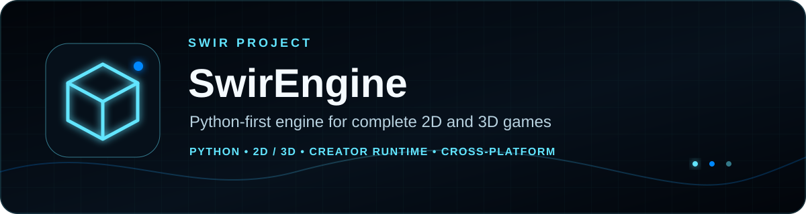
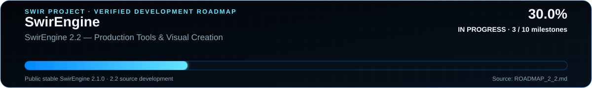

<!-- SWIR-README-STANDARD:v2 -->

<div align="center">



<br>


[](https://pypi.org/project/swirengine/)


[](https://github.com/Swir)
[](https://github.com/Swir/SwirEngine/stargazers)

<br>

[**Install**](#-install) · [**Quick Start**](#-quick-start) · [**2.0 Roadmap**](ROADMAP_2_0.md) · [**Examples**](#-real-game-integration-fixtures) · [**Releases**](https://github.com/Swir/SwirEngine/releases)

</div>


## 📊 Project status



**Active source scope:** SwirEngine 2.0 — Release-Quality Python-First Game Production  
**Verified source progress:** **3/10 milestones = 30.0% — IN PROGRESS**  
**Latest public stable release:** **SwirEngine 1.5.0**  
**Release readiness:** **not beta-ready and not release-ready**; roadmap progress and release readiness are separate gates.

`Release/PyPI: frozen until SwirEngine 2.0`

SwirEngine is a Python-first 2D/3D game engine focused on complete creator workflows: runtime systems,
real rendering validation, deterministic tooling, multiplayer foundations, production project manifests,
diagnostics, export staging and host-native desktop shipping. The repository completed source-only
checkpoints 1.6–1.9 without publishing them; 2.0 is now the active measured development scope.

The first three verified 2.0 milestones lock the published **1.5.0** compatibility floor, integrate
project creation/validation/run/shipping preparation, and add a production-facing multiplayer contract
with compatibility-pinned joins, reconnect resynchronization, authoritative/local state separation and a
headless dedicated-server adapter. Renderer/runtime scalability and resource lifecycle are the next active milestone.

## ✨ Highlights

| Area | Current source capability |
|---|---|
| Unified 2D + 3D | Sprite/tilemap workflows and OpenGL-backed 3D scenes under one Python-first runtime. |
| Scenes + content | Scenes, prefabs, serialization, production scene packages, content build graphs and streaming foundations. |
| Rendering | Materials, lighting, shadows, post-processing, instancing, culling, terrain/LOD and the completed source-only 1.8 render delivery checkpoint. |
| Animation | Tween/timeline/state machines, animation graphs, skeletal animation and GPU skinning paths. |
| Physics + navigation | 2D/3D collision and rigid-body systems, character controllers, navigation and local-avoidance foundations. |
| Audio | Runtime audio engine, buses/groups, spatial behavior and source-development mixer/runtime work. |
| UI + input | Retained UI, focus/navigation, keyboard/mouse/gamepad input and production rebinding/settings foundations. |
| Saves + profiles | Save/profile APIs plus source-development autosave, recovery and production user-data integration. |
| Networking | TCP/gameplay APIs plus source-only production session/replication contracts, compatibility fingerprints, reconnect resynchronization and a headless dedicated-server adapter used by the multiplayer fixture. |
| Creator workflow | `swirengine workflow` composes project/run/scene/content/settings/save-policy checks, safe preparation, export-profile validation and actionable diagnostics. |
| Diagnostics | Profiling, runtime diagnostics, bounded crash/support reporting and deterministic build identity. |
| Compatibility | Published 1.5.0 root API is the explicit 2.0 migration floor; source-only checkpoints were not public releases. |

## 📦 Install

The latest **public stable package is 1.5.0**.

Published validation covers Python **3.10–3.13** on Windows, Linux and macOS, plus the documented
Python 3.14 Windows x86-64 native-wheel path. The final 2.0 support matrix will be re-established by
the dedicated 2.0 roadmap and must not be inferred from source-development success alone.

```bash
python -m pip install -U swirengine==1.5.0
```

Optional audio support:

```bash
python -m pip install -U "swirengine[audio]==1.5.0"
```

Current source development:

```bash
git clone https://github.com/Swir/SwirEngine.git
cd SwirEngine
git fetch --tags
python -m pip install -e ".[dev]"
```

> `pyproject.toml` intentionally remains at 1.5.0 until the verified final SwirEngine 2.0 release gate.
> No 1.6, 1.7, 1.8 or 1.9 package/tag/release is created.

## 🚀 Quick Start

### 2D

```python
from swirengine import Color, Game, Rectangle2D

game = Game("My 2D Game", 1280, 720, mode="2d")
player = game.add(Rectangle2D(0, 0, 120, 70, Color(0.1, 0.75, 1.0, 1.0)))

@game.update
def update(dt):
    speed = 380
    if game.key("A"):
        player.x -= speed * dt
    if game.key("D"):
        player.x += speed * dt

game.run()
```

### 3D

```python
from swirengine import Color, Cube3D, Game, Vec3

game = Game("My 3D Game", 1280, 720, mode="3d")
cube = game.add(Cube3D(position=Vec3(0, 0, -4), color=Color(0.2, 0.7, 1.0, 1.0)))

@game.update
def update(dt):
    cube.rotation.y += 50 * dt
    cube.rotation.x += 25 * dt

game.run()
```

## 🧭 Current 2.0 development workflow

The active roadmap is [`ROADMAP_2_0.md`](ROADMAP_2_0.md). Its ten release-quality milestones cover:

1. public API and migration compatibility;
2. creator workflow and integrated tooling;
3. multiplayer and dedicated-server production behavior;
4. renderer/runtime scalability and resource lifecycle;
5. the final Python/platform support matrix;
6. representative 2D/3D/multiplayer shipping workflows;
7. packaging, clean installs and native desktop shipping;
8. reproducible performance/competitive evidence;
9. export/build integrity, diagnostics and release safety;
10. the final 2.0 release gate and public PyPI verification.

Milestone 1 locks compatibility to the actual published `v1.5.0` root API rather than a hand-written
subset. Milestone 2 adds one integrated creator inspection/preparation path over the existing project,
run-session, scene/prefab, content-build, input/settings and save/profile policies. New projects receive
editable controls/settings defaults automatically, while existing projects can be prepared without
overwriting user files. Milestone 3 adds deterministic client/server compatibility checks, a production
session facade, reconnect token rotation with forced full resynchronization, explicit authoritative versus
player-local state boundaries and a validated fixed-tick headless dedicated-server path.

```bash
git fetch --tags
python tools/verify_2_0_public_api.py
swirengine new MyGame --mode 3d
swirengine workflow MyGame --profile windows
swirengine workflow MyGame --json
swirengine run MyGame --dry-run
```

For an older source project missing creator directories or editable defaults:

```bash
swirengine workflow . --prepare
```

See:
- [`docs/MIGRATING_TO_2_0.md`](docs/MIGRATING_TO_2_0.md)
- [`docs/public_api_2_0.json`](docs/public_api_2_0.json)
- [`docs/API_STABILITY.md`](docs/API_STABILITY.md)
- [`docs/CREATOR_WORKFLOW_2_0.md`](docs/CREATOR_WORKFLOW_2_0.md)
- [`docs/MULTIPLAYER_PRODUCTION_2_0.md`](docs/MULTIPLAYER_PRODUCTION_2_0.md)
- [`docs/SWIRENGINE_2_0_READINESS_AUDIT.md`](docs/SWIRENGINE_2_0_READINESS_AUDIT.md)
- [`ROADMAP_2_0.md`](ROADMAP_2_0.md)

## 🎮 Real-game integration fixtures

Representative projects are source-only engine integration fixtures and do **not** receive separate releases:

- **SwirEngine 2D Game Demo** — [`examples/2d_game_demo/`](examples/2d_game_demo/)
- **SwirEngine 3D Game Demo** — [`examples/3d_game_demo/`](examples/3d_game_demo/)
- **SwirEngine Multiplayer Game Demo** — [`examples/multiplayer_game_demo/`](examples/multiplayer_game_demo/)
- **Neon Frontier 1.3** — locked historical compatibility fixture
- **Neon Frontier 1.4** — locked compatibility/showcase fixture
- **Neon Cube Hunt 3D** — OpenGL + packaged-runtime regression arena
- **Neon Snake 3D** — complete 3D regression project

The 2.0 real-game gate will drive representative games through the creator workflow, source runtime,
staged export and shipping validation instead of treating isolated subsystem demos as sufficient proof.

## 🧪 Development and verification

```bash
python -m pip install -e ".[dev]"
pytest
ruff check src tests examples demo_projects tools
python -m compileall -q src tests examples demo_projects tools
python tools/verify_creator_workflow_2_0.py
pytest -q tests/test_multiplayer_2_0.py
python examples/multiplayer_game_demo/run_game.py
```

Progress assets are generated from the authoritative **2.0** roadmap:

```bash
python tools/generate_progress_svg.py
python tools/generate_progress_svg.py --check
```

The generator owns one README card, one active-roadmap mini graphic and one reusable SVG marked
**TEMPLATE / NOT PROJECT DATA**. Only the card and mini are embedded as live progress.

The SVG layer visualizes verified roadmap math; it never replaces CI, release, compatibility or
runtime gates.

## 🧱 Architecture and technology

SwirEngine keeps a high-level Python creator surface over modular runtime systems. The repository
contains rendering, scene/ECS, assets, serialization, physics, audio, input/UI, networking, editor,
diagnostics and export/shipping modules with focused regression workflows. Advanced systems remain
available as explicit APIs instead of being hidden behind a single monolithic game object.

The 2.0 architecture work is evaluated against real-game integration, resource lifetime, deterministic
tooling, failure handling and package/export behavior—not feature count alone.

## 🔒 API and release policy

- `v1.4.0` and `v1.5.0` are immutable published historical releases except for genuine maintenance fixes.
- **1.5.0 remains the latest public stable package.**
- 1.6, 1.7, 1.8 and 1.9 are completed source-only checkpoints and are not published.
- The 2D, 3D and multiplayer game demos remain source-only integration fixtures.
- The published 1.5.0 `swirengine.__all__` surface is the starting compatibility floor for 2.0.
- Deliberate 2.0 breaking changes require a documented migration, tests and explicit engineering justification.
- The next GitHub Release, release tag and PyPI publication must be **SwirEngine 2.0**.
- Publication is forbidden until the exact final candidate passes the dedicated Milestone 10 release gate.

Historical locked compatibility evidence remains explicit: **SwirEngine 1.4 is released and locked**.
The published 1.5.0 gate verified **Python 3.10-3.13** cross-platform and Python 3.14 on Windows x86-64.
Its locked 1.5 capability evidence includes **Deterministic Simulation & Replay**, **Save & Profile 2.0**,
**World Streaming 2.0**, **UI Toolkit 2.0** and **Runtime Diagnostics & Profiling 2.0**. These statements
describe published historical release evidence and do not pre-approve the still-unverified final
SwirEngine 2.0 support matrix.

See [`docs/API_STABILITY.md`](docs/API_STABILITY.md) and
[`docs/MIGRATING_TO_2_0.md`](docs/MIGRATING_TO_2_0.md).

## 🗺 Roadmaps

| Line | Scope | Verified state |
|---|---|---:|
| 1.0 | [`ROADMAP.md`](ROADMAP.md) | 31/31 = 100%, historical |
| 1.1 | [`ROADMAP_1_1.md`](ROADMAP_1_1.md) | 10/10 = 100%, historical |
| 1.2 | [`ROADMAP_1_2.md`](ROADMAP_1_2.md) | 10/10 = 100%, historical |
| 1.3 | [`ROADMAP_1_3.md`](ROADMAP_1_3.md) | 10/10 = 100%, locked compatibility |
| 1.4 | [`ROADMAP_1_4.md`](ROADMAP_1_4.md) | 10/10 = 100.0%, released/locked |
| 1.5 | [`ROADMAP_1_5.md`](ROADMAP_1_5.md) | 10/10 = 100.0%, released/locked |
| 1.6 | [`ROADMAP_1_6.md`](ROADMAP_1_6.md) | 10/10 = 100.0%, source-only checkpoint |
| 1.7 | [`ROADMAP_1_7.md`](ROADMAP_1_7.md) | 10/10 = 100.0%, source-only checkpoint |
| 1.8 | [`ROADMAP_1_8.md`](ROADMAP_1_8.md) | 10/10 = 100.0%, source-only checkpoint |
| 1.9 | [`ROADMAP_1_9.md`](ROADMAP_1_9.md) | 10/10 = 100.0%, source-only checkpoint |
| **2.0** | **[`ROADMAP_2_0.md`](ROADMAP_2_0.md)** | **3/10 = 30.0%, active development** |

## ⚠️ Current limitations

- The PyPI package is still 1.5.0; source-only 1.6–2.0 development is not published.
- SwirEngine 2.0 currently has no beta-ready or release-ready claim.
- The final 2.0 Python/OS support matrix has not yet passed its dedicated milestone.
- Desktop build plans are host-native; unsupported cross-compilation is intentionally rejected.
- The dedicated-server contract is headless and deterministic but does not claim public matchmaking, hosting infrastructure or universal transport support.
- Competitive/performance claims must wait for reproducible 2.0 evidence.
- Visual editor ergonomics remain an area for later creator-tooling hardening even though the integrated Milestone 2 workflow is verified.

## 🔎 Search Keywords

`Python game engine` · `Python 2D engine` · `Python 3D engine` · `Python multiplayer engine` ·
`pip game engine` · `game development Python` · `OpenGL Python game engine` · `scene prefab engine` ·
`Python ECS` · `Python physics engine` · `Python game editor` · `desktop game packaging` ·
`PyInstaller game build` · `game engine networking` · `SwirEngine`

---

<div align="center">

**SWIR ENGINEERING · PYTHON-FIRST GAME PRODUCTION**

[GitHub](https://github.com/Swir/SwirEngine) · [Releases](https://github.com/Swir/SwirEngine/releases) · [PyPI](https://pypi.org/project/swirengine/)

</div>
